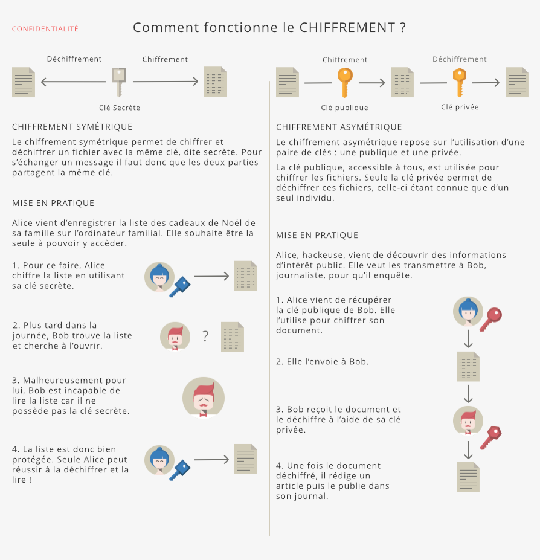

La cryptographie est une des disciplines de la cryptologie s'attachant à protéger des messages (assurant confidentialité, authenticité et intégrité) en s'aidant souvent de secrets ou clés. Elle se distingue de la stéganographie qui fait passer inaperçu un message dans un autre message alors que la cryptographie rend un message supposément inintelligible à autre que qui de droit.

Elle est utilisée depuis l'Antiquité, mais certaines de ses méthodes les plus modernes, comme la cryptographie asymétrique, datent de la fin du xxe siècle.

Historiquement, la cryptologie correspond à la science du secret, c'est-à-dire au chiffrement. Aujourd'hui, elle s’est élargie au fait de prouver qui est l'auteur d'un message et s'il a été modifié ou non, grâce aux signatures numériques et aux fonctions de hachage.

Pourquoi la cryptologie existe-t-elle ?
Pour assurer l’intégrité du message : le hachage
La cryptologie permet justement de détecter si le message, ou l’information, a été involontairement modifié. Ainsi, une « fonction de hachage » permettra d’associer à un message, à un fichier ou à un répertoire, une empreinte unique calculable et vérifiable par tous. Cette empreinte est souvent matérialisée par une longue suite de chiffres et de lettres précédées du nom de l’algorithme utilisé, par exemple « SHA2» ou « SHA256 ».

Il ne faut pas confondre le chiffrement, qui permet d’assurer la confidentialité, c’est-à-dire que seules les personnes visées peuvent y avoir accès (voir « Pour assurer la confidentialité du message »), et le hachage qui permet de garantir que le message est intègre, c'est-à-dire qu’il n’a pas été modifié.

Le hachage, pour quoi faire ?
Pour sauvegarder vos photos sur votre espace d’hébergement (de type « cloud » par exemple) et  vérifier que votre téléchargement s’est bien déroulé ?
Pour sychroniser vos dossiers et détecter ceux qu’il faut sauvegarder à nouveau et ceux qui n’ont pas été modifiés ?

 

Il existe aussi des « fonctions de hachage à clé » qui permettent de rendre le calcul de l’empreinte différent en fonction de la clé utilisée. Avec celles-ci, pour calculer une empreinte, on utilise une clé secrète. Pour deux clés différentes l’empreinte obtenue sur un même message sera différente. Donc pour qu’Alice et Bob calculent la même empreinte, ils doivent tous les deux utiliser la même clé.

C’est parmi ces fonctions de hachage à clé que l’on trouve celles utilisées pour stocker les mots de passe de façon sécurisée.

Le hachage à clé, pour quoi faire ?

Votre service préféré reconnait votre mot de passe quand vous vous connectez ?
Vous voulez pouvoir détecter si quelqu’un modifie des documents sans vous le dire ?

Pour assurer l’authenticité du message : la signature.

Au même titre que pour un document administratif ou un contrat sur support papier, le mécanisme de la « signature » - numérique - permet de vérifier qu’un message a bien été envoyé par le détenteur d’une « clé publique ». Ce procédé cryptographique permet à toute personne de s’assurer de l’identité de l’auteur d’un document et permet en plus d’assurer que celui-ci n’a pas été modifié.

La signature numérique, pour quoi faire ?

Vous voulez garantir être l’émetteur d’un courriel ?
Vous voulez vous assurer qu’une information provient d’une source sûre ?

Pour pouvoir signer, Alice doit se munir d’une paire de clés :

l’une, dite « publique », qui peut être accessible à tous et en particulier à Bob qui est le destinataire des messages qu’envoie Alice ; l’autre, dite « privée », qui ne doit être connue que d’Alice.

En pratique, Alice génère sa signature avec sa clé privée qui n’est connue que d’elle. N’importe quelle personne ayant accès à la clé publique d’Alice, dont Bob, peut vérifier la signature sans échanger de secret.

Pour assurer la confidentialité du message : le chiffrement.

Le chiffrement d’un message permet justement de garantir que seuls l’émetteur et le(s) destinataire(s) légitime(s) d’un message en connaissent le contenu. C’est une sorte d’enveloppe scellée numérique. Une fois chiffré, faute d'avoir la clé spécifique, un message est inaccessible et illisible, que ce soit par les humains ou les machines.

Le chiffrement, pour quoi faire ?

Vous voulez vous assurer que seul le destinataire ait accès au message ?
Vous souhaitez envoyer ces informations sous enveloppe numérique et non lisible par tous comme sur une carte postale ?

Il existe deux grandes familles de chiffrement : le chiffrement symétrique et le chiffrement asymétrique.

Le chiffrement symétrique permet de chiffrer et de déchiffrer un contenu avec la même clé, appelée alors la « clé secrète ». Le chiffrement symétrique est particulièrement rapide mais nécessite que l’émetteur et le destinataire se mettent d’accord sur une clé secrète commune ou se la transmettent par un autre canal. Celui-ci doit être choisi avec précautions, sans quoi la clé pourrait être récupérée par les mauvaises personnes, ce qui n’assurerait plus la confidentialité du message. 

Le chiffrement asymétrique suppose que le (futur) destinataire est muni d’une paire de clés (clé privée, clé publique) et qu’il a fait en sorte que les émetteurs potentiels aient accès à sa clé publique. Dans ce cas, l’émetteur utilise la clé publique du destinataire pour chiffrer le message tandis que le destinataire utilise sa clé privée pour le déchiffrer.

Parmi ses avantages, la clé publique peut être connue de tous et publiée. Mais attention : il est nécessaire que les émetteurs aient confiance en l’origine de la clé publique, qu’ils soient sûrs qu’il s’agit bien de celle du destinataire.

Autre point fort : plus besoin de partager une même clé secrète ! Le chiffrement asymétrique permet de s’en dispenser. Mais il est malheureusement plus lent.

Pour cette dernière raison, il existe une technique combinant chiffrements « symétrique » et « asymétrique », mieux connue sous le nom de « chiffrement hybride ».

Cette fois, une clé secrète est déterminée par une des deux parties souhaitant communiquer et celle-ci est envoyée chiffrée par un chiffrement asymétrique. Une fois connue des deux parties, celles-ci communiquent en chiffrant symétriquement leurs échanges. Cette technique est notamment appliquée lorsque vous visitez un site dont l’adresse débute par « https ».

