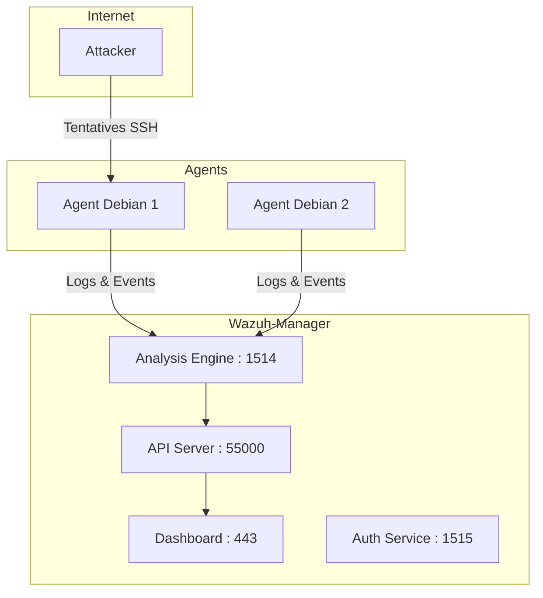

<div align="center">

  <br></br>
  
  <a href="https://github.com/0xCyberLiTech">
  
  </a>
  
  <br></br>

  <h2>Laboratoire numérique pour la cybersécurité, Linux & IT</h2>
  
  <p align="center">
      <a href="https://0xcyberlitech.github.io/">
        
      </a>
      <a href="https://github.com/0xCyberLiTech">
        
      </a>
      <a href="https://github.com/0xCyberLiTech/Cybersecurite/releases/latest">
        
      </a>
      <a href="https://github.com/0xCyberLiTech/Cybersecurite/blob/main/CHANGELOG.md">
        
      </a>
      <a href="https://github.com/0xCyberLiTech?tab=repositories">
        
      </a>
  </p>

</div>

<!-- Optimisation SEO : mots-clés cybersécurité, sécurité informatique, Linux, Debian, administration système, réseau, IT, cryptographie, open source, pare-feu, proxy, reverse proxy, DNS, SSH, Docker, OpenVAS, SIEM, EDR, XDR, SOAR, pentest, forensic, logs, tutoriels, guides, formation, expertise, supervision, ressources techniques, étudiants, professionnels, passionnés, bonnes pratiques, protection des données, analyse de risques, cyberattaque, défense, conformité, audit, gestion de crise, sensibilisation, monitoring, cloud, virtualisation, DevSecOps. -->

<div align="center">
  
</div>

<div align="center">
  <p>
    <strong>Cybersécurité</strong>  • <strong>Linux Debian</strong>  • <strong>Sécurité informatique</strong> 
  </p>
</div>

---

# 🛡️ TP — Wazuh : Installation et Tests en Lab (Debian 12 & 13)

> **Licence :** Wazuh est 100% **gratuit et open-source** (GPLv2 / Apache 2.0).  
> Aucune fonctionnalité payante n’est cachée. Le support commercial existe mais reste optionnel.

---

## 1) Introduction à Wazuh

- **Nature :** SIEM + EDR/XDR open source.  
- **Fonctions clés :**  
  - Collecte et corrélation de journaux.  
  - Détection d’intrusion et vulnérabilités.  
  - Surveillance de l’intégrité des fichiers (FIM).  
  - Tableaux de bord de conformité (PCI, GDPR, HIPAA, NIST).  
  - Réponse active (blocage IP, alertes).  

---

## 2) Architecture simplifiée

### Schéma global (Manager + Agents)



👉 **Résumé :**  
- Les **agents** envoient leurs journaux au **Manager** (port 1514).  
- Le **Manager** corrèle, détecte, applique des réponses actives.  
- L’**API** (55000) expose les données au **Dashboard** (443).  
- L’**enrôlement des agents** passe par le port 1515.

---

## 3) Préparation (Debian 12/13)

### 3.1 Prérequis système
- OS : Debian 12 (Bookworm) ou Debian 13 (Trixie).  
- Ressources minimales : **4 vCPU / 8 Go RAM / 50 Go disque** (lab ≤ 25 agents).  
- Accès root/sudo et Internet sortant.  

### 3.2 Mise à jour + dépendances
```bash
sudo apt-get update && sudo apt-get upgrade -y
sudo apt-get install -y curl gnupg lsb-release ufw chrony
```

### 3.3 Pare-feu conseillé (UFW)
```bash
sudo ufw allow 443/tcp    # Dashboard
sudo ufw allow 1514/tcp   # Agent -> Manager
sudo ufw allow 1515/tcp   # Enrôlement agent
sudo ufw allow 55000/tcp  # API Server
sudo ufw enable
```

---

## 4) Installation du serveur Wazuh (all-in-one)

### 4.1 Script officiel
```bash
curl -sO https://packages.wazuh.com/4.12/wazuh-install.sh
sudo bash ./wazuh-install.sh -a
```

🎯 **Résultat attendu :** affichage du mot de passe `admin`.

### 4.2 Accès au Dashboard
- URL : `https://<IP_SERVEUR>`  
- Identifiant : `admin` / mot de passe généré.

---

## 5) Ajout d’un agent Debian

### 5.1 Installer l’agent
Sur la machine cliente :
```bash
curl -s https://packages.wazuh.com/key/GPG-KEY-WAZUH |   sudo gpg --no-default-keyring --keyring gnupg-ring:/usr/share/keyrings/wazuh.gpg --import

echo "deb [signed-by=/usr/share/keyrings/wazuh.gpg] https://packages.wazuh.com/4.x/apt/ stable main"   | sudo tee /etc/apt/sources.list.d/wazuh.list

sudo apt-get update

WAZUH_MANAGER="IP_DU_MANAGER" sudo apt-get install -y wazuh-agent
sudo systemctl enable --now wazuh-agent
```

### 5.2 Vérification
```bash
sudo systemctl status wazuh-agent
```
Agent doit être en **active (running)**.

---

## 6) Scénarios de test labo

### 6.1 Brute force SSH
- Tentez plusieurs connexions SSH invalides vers l’agent.  
- Attendez la génération d’alertes dans le Dashboard.

### 6.2 Intégrité fichiers (FIM)
- Modifiez `/etc/hosts` sur l’agent Debian.  
- Une alerte FIM doit apparaître.

### 6.3 Test antivirus (EICAR)
- Créez `/tmp/eicar.com` avec la signature EICAR standard.  
- Déclenchement attendu : alerte de détection malware.

### 6.4 Active Response
- Avec Active Response activé, un brute force SSH peut déclencher un blocage IP automatique.  
- Vérifiez que l’IP source est bannie.

---

## 7) Exploration du Dashboard

Sans capture, voici les principaux modules à consulter :

- **Vulnérabilités** : liste des packages vulnérables détectés sur les agents.  
- **Conformité (PCI, GDPR, NIST, HIPAA)** : règles d’audit et scoring.  
- **Threat Hunting (MITRE ATT&CK)** : mappage des alertes à la matrice MITRE.  
- **Règles et décodeurs** : gestion de la logique de détection.  
- **Logs & Recherche** : moteur de recherche pour analyser les événements collectés.  

---

## 8) Désinstallation

### Serveur
```bash
sudo bash ./wazuh-install.sh -u
```

### Agent
```bash
sudo systemctl stop wazuh-agent
sudo apt-get purge -y wazuh-agent
sudo rm -rf /var/ossec
```

---

## 9) Points pratiques labo

- Utilisez des **snapshots de VM** pour rejouer les tests.  
- Ne pas exposer directement le Dashboard sur Internet sans proxy inverse + SSL.  
- Sauvegardez `wazuh-install-files.tar` (certificats initiaux + mots de passe).  
- Déployer le Manager plutôt sur Debian 12 pour plus de stabilité (Debian 13 encore jeune).  

---

## 🎯 Conclusion

- Wazuh = **SIEM/EDR complet open source**.  
- Installation rapide avec le script officiel.  
- Agents simples à enrôler.  
- Fonctionnalités testables en lab : brute-force SSH, FIM, malware, active response.  
- Dashboard riche : vulnérabilités, conformité, MITRE, hunting.  

👉 Vous disposez maintenant d’un **environnement de test opérationnel** pour apprendre la détection et la réponse sécurité.

---

## 📚 Références utiles

- [Quickstart Wazuh](https://documentation.wazuh.com/current/quickstart.html)  
- [Dashboard navigation](https://documentation.wazuh.com/current/user-manual/wazuh-dashboard/navigating-the-wazuh-dashboard.html)  
- [Agents install](https://documentation.wazuh.com/current/installation-guide/wazuh-agent/)  
- [Ports par défaut](https://documentation.wazuh.com/current/user-manual/agent/agent-enrollment/requirements.html)  
- [Livre blanc (Licence)](https://wazuh.com/resources/white-paper/)  

---

<div align="center">
  <a href="https://github.com/0xCyberLiTech" target="_blank" rel="noopener">
    
  </a>
</div>

<div align="center">
  <b>🔒 Un guide proposé par <a href="https://github.com/0xCyberLiTech">0xCyberLiTech</a> • Pour des tutoriels accessibles à tous. 🔒</b>
</div>

