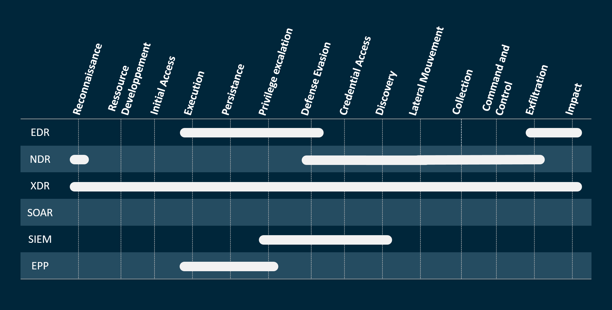

  

<h1 align="center">🌐 CYBERSÉCURITÉ 🌐</h1>

  Un dépôt pédagogique autour des fondamentaux de la cybersécurité. 
  📘 Apprentissage – 🔐 Sécurité – 🧠 Compréhension

---
<h3 align="left">👋 EPP / EDR / NDR / XDR</h3>

Les solutions de détection et réponse se multiplient sur le marché et semblent promettre de contrer toutes les attaques.  
Mais alors :

- Qu’en est-il vraiment ?  
- Quelle solution est la plus adaptée à votre contexte ?  
- Quelles différences entre ces outils ?  
- À quelles menaces peuvent-ils répondre ?

---

### Quelques notions clés sur la détection

- **Analyse statique** : comparaison du hash ou des caractéristiques d’un programme suspect avec une base de données connue.  
- **Analyse heuristique** : comparaison des comportements d’un programme suspect avec une liste statique de comportements malveillants.  
- **Analyse comportementale** : utilisation du machine learning pour identifier des comportements malveillants qui évoluent avec les menaces.

---

### Le contexte

Le jargon en cybersécurité est dense et les acronymes nombreux. Face à la sophistication des attaques (terminaux, réseau, cloud…), de nombreuses entreprises adoptent une nouvelle approche : l’**Extended Detection and Response (XDR)**. Ce concept, bien qu’encore en évolution, suscite un fort intérêt.

---

## Qu’est-ce que l’EPP ?

**EPP (Endpoint Protection Platform)** propose une détection basée sur des signatures connues sur les terminaux.  

C’est une solution proche de l’antivirus traditionnel avec quelques améliorations :  
- analyse statique et heuristique  
- surveillance mémoire  
- vérification d’IOCs (indicateurs de compromission)  

Cependant, cette détection reste assez facilement contournable. Certaines solutions antivirus modernes intègrent déjà ces caractéristiques. L’EDR est quant à lui plus avancé, offrant meilleure protection et outils de réponse/investigation pour un coût similaire.

---

## Qu’est-ce que l’EDR ?

L’**Endpoint Detection and Response (EDR)** surveille les terminaux pour détecter les comportements suspects et enregistre chaque activité.  

Il corrèle ces informations pour mieux détecter les menaces avancées et peut déclencher des réponses automatisées (ex : isolation d’un poste infecté) en quasi-temps réel.

---

## Qu’est-ce que l’XDR ?

L’**XDR** est une évolution de l’EDR qui étend la détection :  

- Au-delà des terminaux, il couvre également les réseaux, serveurs, workloads cloud, SIEM, etc.  
- Il offre une vue unifiée et centralisée sur plusieurs outils et vecteurs d’attaque.  
- Il facilite la contextualisation des menaces pour accélérer le tri, l’investigation et la remédiation.  
- L’XDR collecte et corrèle automatiquement des données de sécurité multi-sources pour détecter plus rapidement les menaces.  
- Les analystes peuvent ainsi réagir vite, avant la propagation d’une menace.

---

## XDR et SIEM : quelle différence ?

- Le **SIEM** (Security Information and Event Management) collecte, agrège, analyse et stocke de gros volumes de logs provenant de toute l’entreprise.  
- Il sert à la gouvernance, conformité, détection et traque des menaces.  
- Toutefois, il demande beaucoup d’ajustements et génère souvent un trop grand nombre d’alertes, ce qui peut saturer les équipes de sécurité.  
- Le SIEM est essentiellement un outil analytique passif qui génère des alertes mais ne répond pas directement.

En revanche, **l’XDR** vise à dépasser ces limites avec une détection et une réponse plus efficaces, intégrant l’analyse comportementale, la Threat Intelligence, le profilage, etc.

---

## XDR et SOAR : quelle différence ?

- Le **SOAR** (Security Orchestration, Automation and Response) automatise les réponses via des playbooks complexes et nécessite un SOC mature.  
- L’**XDR** propose une approche plus simple, intuitive et sans code, avec des automatisations plus basiques.  
- L’XDR peut être vu comme un « SOAR léger » qui automatise les réponses simples et s’intègre facilement aux outils tiers.

---

## Qu’est-ce que le MXDR ?

Le **Managed Extended Detection and Response (MXDR)** est un service managé qui combine :

- la détection étendue  
- la réponse rapide  
- la traque des menaces sur terminaux, réseaux, cloud, etc.

Il augmente les capacités XDR par des services de surveillance, investigation et réponse gérés par un prestataire.

---

## Pourquoi tout ce buzz autour de l’XDR ?

L’XDR remplace les environnements cloisonnés par une approche unifiée et centralisée.  
Cette visibilité accrue permet :  

- de réduire le **MTTD** (Mean Time To Detect)  
- d’accélérer le **MTTI** (Mean Time To Investigate)  
- de raccourcir le **MTTR** (Mean Time To Respond)  
- d’améliorer la visibilité globale  

Avec l’IA et l’automatisation, l’XDR réduit aussi la charge de travail des analystes, détecte les menaces sophistiquées rapidement, et augmente le ROI en cybersécurité.

---

## Comparaison des solutions EPP, EDR, NDR, XDR, SIEM et SOAR

### Périmètre de détection selon les étapes MITRE ATT&CK :

  

---

## 🌐 À propos de moi

- 💡 Passionné par Debian GNU/Linux depuis plusieurs années
- 🎓 Autodidacte, avec un fort esprit de transmission
- 🔐 Intéressé par la cybersécurité, les solutions open source et la performance système
- 🧪 Toujours partant pour tester une nouvelle stack technique

---

  🔒 Un guide proposé par <a href="https://github.com/0xCyberLiTech">0xCyberLiTech</a> • Pour des tutoriels accessible à tous.

