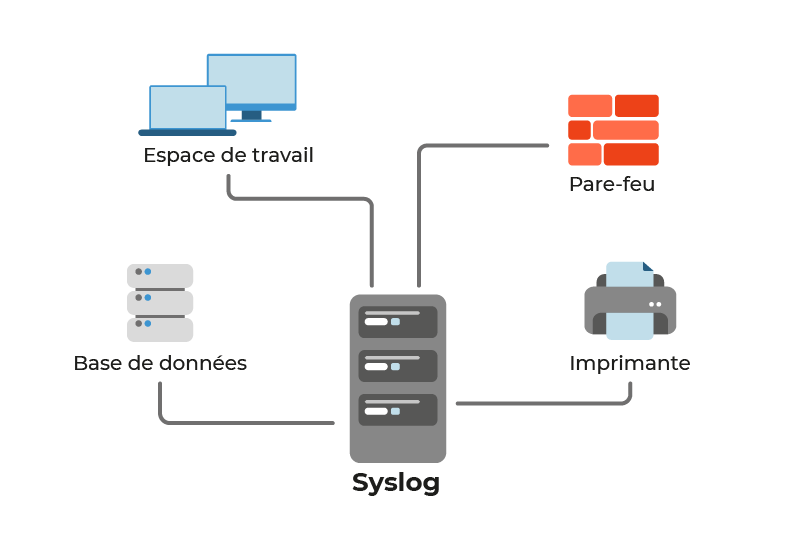
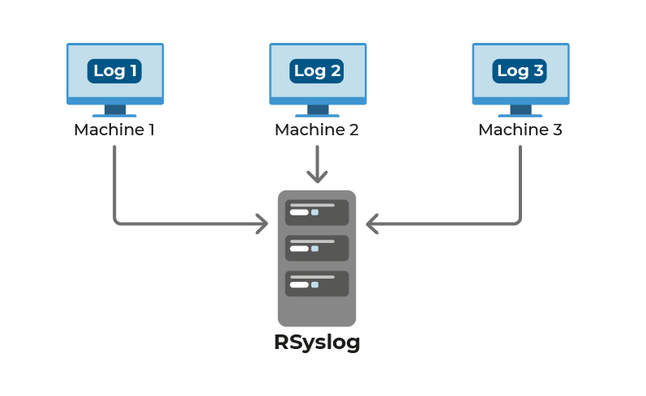

Pour gérer et exploiter vos logs Linux, nous utiliserons un serveur rsyslog.

Voyons ensemble comment le protocole fonctionne, et pourquoi installer ce type de serveur.

Découvrez syslog.

Quand vos logs vous sont remontés, ils contiennent beaucoup d’informations sur ce qui se passe sur votre système.

Le protocole syslog est utilisé pour l'envoi et la réception de logs dans un format particulier, à partir de divers systèmes. Les messages incluent les horodatages, les messages d'événements, la criticité, les adresses IP, les diagnostics, etc., mais de façon digeste.

Le protocole syslog a été conçu pour surveiller les périphériques réseaux et systèmes afin d'envoyer des messages de notification en cas de dysfonctionnement.

Il peut vous envoyer aussi des alertes pour les événements prénotifiés, et surveiller les activités suspectes via les différents journaux de monitoring.

Le protocole syslog a été initialement écrit par Eric Allman, et est défini dans la RFC 3164, un des documents officiels qui décrit les spécifications techniques de l'Internet. Les messages sont envoyés à travers le réseau IP vers les collecteurs de messages d'événements ou les serveurs syslog. Syslog utilise le protocole UDP (User Datagram Protocol), port 514, pour communiquer. Depuis 2009, Syslog a été normalisé par l'Internet Engineering Task Force dans la RFC 5424.

Il existe 3 versions différentes de syslog :

- Syslog : la version initiale dont nous venons de discuter. Les autres versions sont des versions améliorées. 

- Syslog-ng : il étend les fonctionnalités initiales en ajoutant le filtrage basé sur le contenu, le support TCP et le chiffrement TLS.

- Rsyslog : la dernière version, mais aussi la plus utilisée. 

Dans ce cours, nous nous concentrerons sur Rsyslog. Il fonctionne sur le modèle client/serveur. Par défaut, les logs sont gérés localement. Votre serveur Rsyslog sera un point unique de centralisation, auquel vos clients pourront envoyer leurs logs.

Les logs sont classés selon plusieurs thématiques :

| Thématique  |  Définition |
|---    |--   |
|  auth  | utilisé pour des évènements concernant la sécurité ou l'authentification à travers des applications d'accès (type SSH) |
|  authpriv | utilisé pour les messages relatifs au contrôle d'accès |
|  daemon  | utilisé par les différents processus systèmes et d'application |
|  kern  | utilisé pour les messages concernant le kernel |
|  mail | utilisé pour les évènements des services mail |
|  user  | par défaut quand aucun n'est spécifié |
|  local7 | utilisé pour les messages du boot |
|  * | désigne tous les éléments  |
|  none | ne désigne aucun élément |

Les logs sont également classés par log level :
|  Log level  | Signification |
|-----|-----|
| Emerg | urgence, système inutilisable |
| Alert | intervention immédiate nécessaire |
| Crit | erreur système critique |
| Err | erreur de fonctionnement |
| Warning | avertissement |
| Notice | évènement normaux devant être signalés |
| Info | pour information |
| Debug | message de déboguage |

Installez et configurez un serveur rsyslog.

Dans notre cas de figure, la société NeedSec utilise également des machines sous Linux.

Pour créer notre infrastructure, nous allons configurer notre serveur rsyslog sur une machine Ubuntu.

La remontée de logs se fera depuis n’importe quel système Linux.

Votre infrastructure ressemblera à la suivante :

Source : https://openclassrooms.com/fr/courses/1750566-optimisez-la-securite-informatique-grace-au-monitoring/7144797-collectez-des-logs-avec-rsyslog-sous-linux
