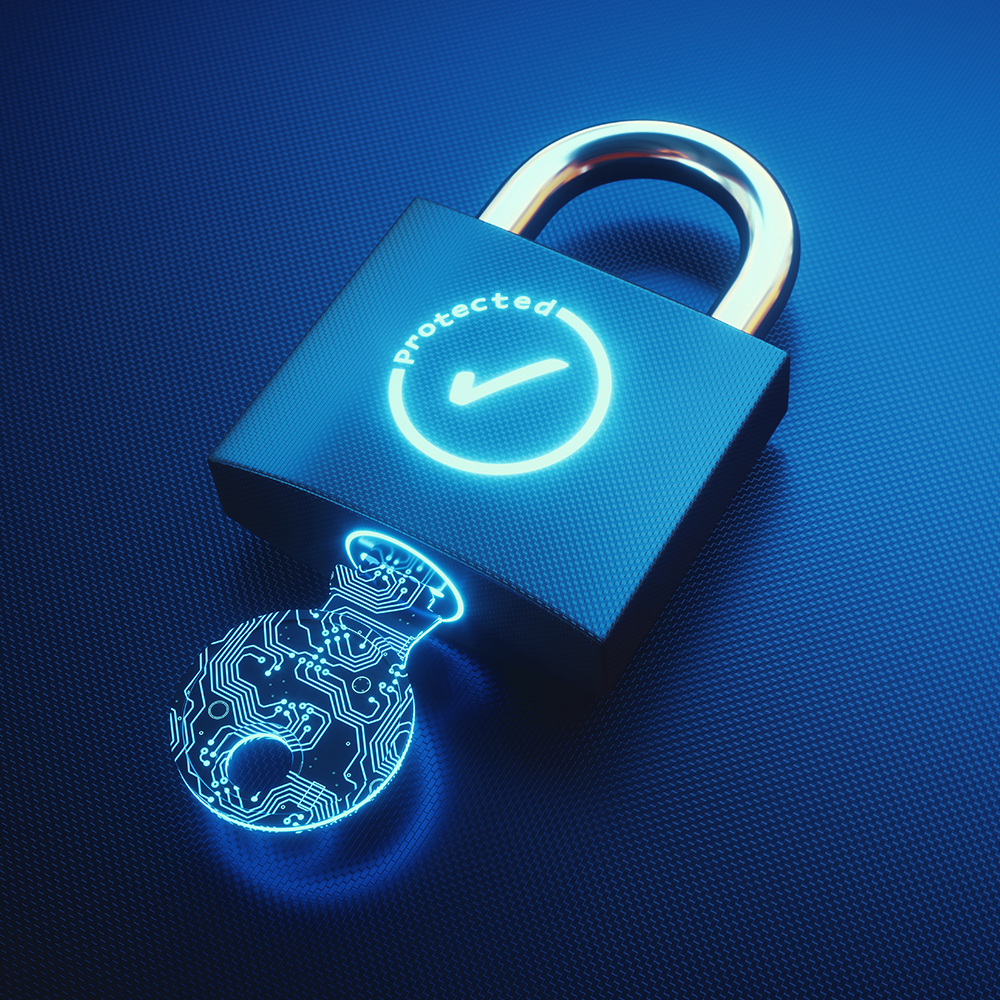

👋 ## Programmes malveillants ?

Un logiciel malveillant (ou malware) désigne un logiciel destiné à nuire à l'utilisateur. 
Un logiciel malveillant touche non seulement l'ordinateur ou l'appareil qu'il infecte en premier, mais potentiellement aussi tous les appareils avec lesquels celui-ci communique.

Il englobe les vers et chevaux de Troie les plus simples comme les virus informatiques les plus complexes.
Les logiciels malveillants, les virus et les codes malveillants partagent certes des points communs, mais ils restent différents. 
C'est pourquoi un seul type de logiciel antivirus ou anti-logiciels malveillants ne suffit pas pour se prémunir contre toutes les menaces. 
Ordinateurs de bureau, ordinateurs portables, appareils mobiles… Aucun périphérique n'est épargné par les logiciels malveillants qui peuvent prendre des formes variées et utiliser différentes techniques d'attaque selon le système d'exploitation installé sur l'appareil (Windows, Android, iOS ou Apple MacOS). 
Aucun appareil n'est jamais totalement à l'abri de ces menaces, d'où l'intérêt de les protéger, et ce, qu'ils soient destinés à un usage professionnel ou personnel.

Grâce à une stratégie de sécurité informatique efficace, votre entreprise peut se prémunir contre les attaques par logiciel malveillant. La gestion des correctifs, pour corriger les vulnérabilités de vos systèmes, et le contrôle des accès, pour limiter les dégâts causés par ces logiciels, sont les deux pratiques de cybersécurité les plus couramment utilisées. Si vous sauvegardez en plus régulièrement vos données hors des principaux systèmes de production, vous pourrez vous remettre d'une attaque de façon rapide et sûre.

## Pourquoi les logiciels malveillants sont-ils préoccupants ?

Imaginez que vous travaillez dans une entreprise de taille moyenne. Comme tous les matins, vous arrivez au bureau, vous vous préparez un café, puis vous allumez votre ordinateur. Et là, tout part de travers.

Au lieu de votre Bureau, un écran rouge sang s'affiche avec un cadenas, un compte à rebours et le message « Vos fichiers ont été chiffrés. Faute de paiement de votre part d'ici sept jours, ils seront irrécupérables ». Vous regardez autour de vous. Chacun leur tour, vos collègues découvrent le même message. Celui-ci s'affiche sur tous les ordinateurs, sans exception.

Cette attaque s'est réellement produite en mai 2017, dans le monde entier. Le logiciel malveillant WannaCry a touché des entreprises, des entités gouvernementales et des services publics sensibles, notamment des hôpitaux.

Les logiciels malveillants ne s'annoncent pas toujours de manière si théâtrale. Ils peuvent très bien s'exécuter sur votre ordinateur à votre insu, et ralentir le système ou compromettre la sécurité de vos informations confidentielles. Bien souvent, les cybercriminels s'arrangent pour que ces programmes soient indétectables et exécutent des tâches visibles uniquement dans des conditions bien spécifiques.

S'il est pratiquement impossible d'arrêter les logiciels malveillants, vous pouvez limiter leur impact sur l'exploitation en vous tenant informé et en appliquant des techniques de protection adaptées.

## Les différentes catégories de logiciels malveillants.

Intéressons-nous aux différentes catégories de logiciels malveillants pour comprendre les risques qu'ils représentent et comment protéger au mieux l'entreprise. Si vous n'êtes pas vigilant, ces logiciels malveillants sont capables d'infiltrer n'importe quel appareil, un ordinateur portable Apple comme un appareil mobile Android.

Un logiciel malveillant utilise un système de distribution pour se propager et une charge, sous la forme de code, pour atteindre son objectif.Il est structuré schématiquement de la manière suivante (voir les explications détaillées plus loin) :

Systèmes de distribution :

- Cheval de Troie                        : Trompe l'utilisateur pour l'inciter à l'installer. |
- Ver                                    : Se duplique de façon autonome.|    

Peuvent être associés aux systèmes suivants :

- Exploit                                : accède à un système et à des données sensibles en exploitant une vulnérabilité logicielle.
- Hameçonnage                            : trompe l'utilisateur pour l'inciter à fournir des informations qui seront utilisées pour obtenir des accès.
- Rootkit ou bootkit                     : accède à un système avec des droits d'administrateur pour contrôler davantage de ressources de façon furtive.

Charges :

- Logiciel publicitaire                  : Diffuse des annonces indésirables.
- Botnet                                 : Permet à un tiers de piloter un appareil.
- Logiciel de minage de cryptomonnaie    : Utilise les ressources de calcul pour effectuer des opérations liées aux cryptomonnaies.
- Rançongiciel                           : Extorque de l'argent à l'utilisateur.
- Logiciel espion                        : Collecte des données à l'insu de l'utilisateur, au moyen d'un enregistreur de frappe, par exemple.                    
- Autres dommages                        : Destruction de données, vandalisme, sabotage.

Chevaux de Troie :

Les chevaux de Troie se propagent grâce à une technique appelée « ingénierie sociale ». Ils prennent une autre apparence afin que les utilisateurs les installent à leur insu. L'attaque la plus courante consiste à convaincre l'utilisateur d'ouvrir un fichier ou un lien web, lequel va lancer l'installation du logiciel malveillant.Un alarmiciel (ou scareware), par exemple, persuadera l'utilisateur que le programme peut l'aider à protéger son ordinateur, alors qu'il fait totalement l'inverse. 

Parfois aussi, l'utilisateur installe une application censée lui rendre service (comme une barre d'outils astucieuse pour son navigateur ou un clavier d'émoticônes rigolotes), mais qui renferme un logiciel malveillant. Les pirates peuvent également remettre à un utilisateur peu méfiant une clé USB (ou un disque USB) qui contient un logiciel malveillant avec un programme d'installation automatique.Enfin, avec les chevaux de Troie à accès distant, les cybercriminels peuvent contrôler à distance un appareil après s'être infiltrés.

Vers :

Les vers envahissent des espaces où ils ne sont pas les bienvenus. Lorsqu'ils sont apparus dans les années 1970, les vers informatiques pouvaient seulement se dupliquer. Ils ont commencé à faire davantage de dégâts dans les années 1980. Ces premiers virus informatiques se propageaient alors d'un ordinateur à l'autre au moyen de disquettes et corrompaient les fichiers auxquels ils accédaient. Avec l'essor d'Internet, les développeurs de logiciels malveillants et les pirates ont eu l'idée de créer des vers capables de se dupliquer sur les réseaux, lesquels sont alors devenus une menace pour les entreprises et les utilisateurs connectés au Web.

Exploits :

Un exploit représente une vulnérabilité d'un logiciel qui peut être exploitée de façon illicite pour forcer le logiciel en question à exécuter une opération non prévue à l'origine. Un logiciel malveillant peut s'appuyer sur cette faille pour pénétrer un système ou s'y déplacer. Les exploits reposent souvent sur des vulnérabilités connues (ou CVE, Common Vulnerability Enumeration) et comptent sur le fait que certains utilisateurs ne mettent pas régulièrement à jour leurs systèmes à l'aide des correctifs de sécurité. Moins courants, les exploits jour zéro profitent d'une faille critique qui n'est pas encore résolue par un programme de maintenance logicielle.

Hameçonnage :

L'hameçonnage, une forme d'ingénierie sociale, est une attaque qui consiste à tromper un utilisateur pour l'inciter à fournir des informations sensibles ou des données personnelles au moyen, par exemple, d'un e-mail frauduleux ou d'une escroquerie. L'hameçonnage est parfois utilisé pour obtenir les mots de passe et informations d'identification nécessaires à lancer une attaque par logiciel malveillant.

Rootkits et bootkits :

Un rootkit est un ensemble d'outils logiciels dont le but est d'obtenir un accès complet à un système sans laisser aucune trace. Il parvient à prendre le contrôle d'un système en mode administrateur. Encore plus difficiles à détecter, les bootkits sont des rootkits sophistiqués qui infectent un système au niveau du noyau pour mieux le contrôler.

Logiciels publicitaires et logiciels espions :

Les logiciels publicitaires encombrent votre appareil d'annonces indésirables (les pop-ups qui s'affichent dans votre navigateur web, par exemple).Les logiciels espions, leurs proches cousins, collectent des informations vous concernant avant de les transmettre à d'autres systèmes. Il peut s'agir de dispositifs qui surveillent vos actions sur Internet ou encore d'outils d'espionnage très perfectionnés. Les logiciels espions peuvent contenir des enregistreurs de frappe (ou keyloggers), qui enregistrent tout ce qu'un utilisateur tape sur son clavier. Ainsi, les logiciels publicitaires et les logiciels espions violent votre vie privée, et peuvent aussi ralentir votre système et engorger le réseau.

Botnets :

Les botnets permettent à un tiers de piloter un appareil, qui rejoint alors un réseau plus vaste d'appareils infectés. Ce type de logiciel malveillant est le plus souvent utilisé pour des attaques par déni de service distribuées (DDoS), l'envoi de courrier indésirable ou le minage de cryptomonnaie. Tout appareil non protégé accessible via un réseau est susceptible d'être infecté. Les botnets sont capables d'étendre leur réseau d'appareils et d'effectuer plusieurs actions malveillantes de manière simultanée ou séquentielle. En 2016, par exemple, le logiciel malveillant Mirai a réussi à créer un botnet DDoS géant en pilotant des caméras connectées à Internet et des routeurs domestiques.

Rançongiciels :

Un rançongiciel est un logiciel malveillant destiné à extorquer de l'argent en échange de quelque chose. La technique la plus courante consiste à chiffrer des fichiers sur le système d'un utilisateur et à exiger une rançon en bitcoins en échange d'une clé de déchiffrement. Particulièrement répandus dans le milieu des années 2000, les rançongiciels représentent aujourd'hui encore l'une des menaces informatiques les plus graves et généralisées. 

Autres dommages :

Le développeur ou l'opérateur d'un logiciel malveillant a parfois pour objectif de détruire des données ou d'endommager d'autres ressources. Le virus Michelangelo qui a sévi en 1992, soit bien avant l'époque des rançongiciels, fut l'un des premiers programmes malveillants à faire autant parler de lui. Il avait été conçu pour écraser les données du disque dur des ordinateurs infectés le 6 mars très précisément. Quelques années plus tard, en 2000, le virus ILOVEYOU s'est propagé entre utilisateurs sous la forme d'un script Visual Basic envoyé en pièce jointe. Son exécution entraînait la destruction de plusieurs fichiers et l'envoi d'une copie du script à tous les contacts figurant dans le carnet d'adresses de l'utilisateur.

Ces virus semblent aujourd'hui bien désuets face aux logiciels malveillants modernes. Prenons l'exemple de Stuxnet. En 2010, la communauté des spécialistes de la sécurité a découvert un ver très déroutant et d'une extrême complexité, conçu pour pirater des équipements industriels bien spécifiques. De nombreux experts de la sécurité sont aujourd'hui convaincus que Stuxnet a été créé par les gouvernements américains et israéliens afin de saboter les programmes d'armement nucléaire de l'Iran (bien qu'aucun gouvernement ne l'ait jamais officiellement admis). Si l'information était avérée, ce virus constituerait une nouvelle forme de logiciel malveillant, à savoir une cyberattaque commanditée par un État.

Le premier moyen de défense, et le plus efficace, est de ne pas être infecté. Si les logiciels antivirus ou anti-logiciels malveillants s'avèrent utiles, il existe d'autres stratégies à adopter dès aujourd'hui pour améliorer votre résilience.
